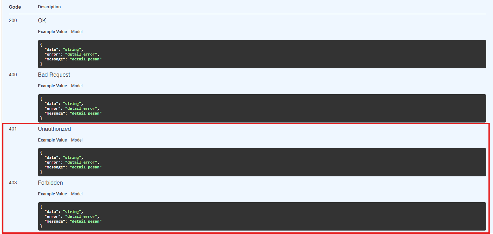

# Praktikum Pertemuan 13

## Dokumentasi API Golang Fiber Menggunakan Swagger

Pada Praktikum 13 ini kita menambahkan **Swagger UI** pada backend `be_latihan` agar endpoint API dapat didokumentasikan dan diuji langsung melalui browser.

Project yang digunakan adalah lanjutan dari praktikum sebelumnya:

- Backend menggunakan **Golang Fiber**
- Database menggunakan **PostgreSQL/Supabase** melalui **GORM**
- Autentikasi menggunakan **JWT Bearer Token**
- Endpoint mahasiswa sudah dilindungi middleware JWT
- Endpoint auth sudah memiliki `register`, `login`, dan `change-password`

---

# Tujuan Pembelajaran

Setelah mengikuti praktikum ini, mahasiswa mampu:

- Menginstall package Swagger untuk Golang Fiber
- Menambahkan metadata Swagger pada file `main.go`
- Menyediakan route `/docs/*` untuk membuka Swagger UI
- Membuat dokumentasi endpoint `register` dan `login`
- Membuat dokumentasi endpoint yang membutuhkan JWT Bearer Token
- Membuat dokumentasi endpoint CRUD Mahasiswa
- Menjalankan `swag init` untuk menghasilkan folder `docs`
- Menguji API langsung dari Swagger UI

---

# Alur Praktikum

```text
Install package Swagger
      |
      v
Tambahkan anotasi metadata di main.go
      |
      v
Tambahkan route /docs/*
      |
      v
Tambahkan anotasi pada handler
      |
      v
Jalankan swag init
      |
      v
Jalankan backend
      |
      v
Buka http://127.0.0.1:3000/docs
      |
      v
Uji endpoint login dan CRUD Mahasiswa dari Swagger UI
```

---

# Bagian 1 - Persiapan Swagger

## STEP 1 - Masuk ke Folder Backend

Buka terminal, lalu masuk ke folder backend:

```bash
cd be_latihan
```

Semua perintah Go pada praktikum ini dijalankan dari folder `be_latihan`.

---

## STEP 2 - Install Swagger CLI

Install tools `swag` untuk generate dokumentasi Swagger:

```bash
go install github.com/swaggo/swag/cmd/swag@latest
```

Jika command `swag` belum dikenali setelah install, pastikan folder Go binary sudah masuk ke `PATH`.

Pada Windows biasanya berada di:

```text
%USERPROFILE%\go\bin
```

Untuk mengecek apakah `swag` sudah bisa dipakai, jalankan:

```bash
swag --version
```

---

## STEP 3 - Install Package Swagger untuk Fiber v2

Masih di folder `be_latihan`, jalankan:

```bash
go get github.com/gofiber/swagger
go mod tidy
```

Package `github.com/gofiber/swagger` digunakan untuk menampilkan Swagger UI pada aplikasi **Fiber v2**.

---

## STEP 3A - Jalankan `swag init` di Awal

Sebelum masuk ke konfigurasi Swagger di `main.go`, jalankan perintah berikut terlebih dahulu:

```bash
swag init
```

Perintah ini dijalankan di awal untuk membuat folder `docs` terlebih dahulu.

Tidak masalah jika dokumentasi Swagger belum lengkap pada tahap ini. Nanti setelah semua anotasi endpoint selesai ditambahkan sampai Bagian 5, perintah `swag init` akan dijalankan kembali pada Bagian 6 untuk memperbarui isi dokumentasi Swagger.

---

# Bagian 2 - Konfigurasi Swagger di Backend

## STEP 4 - Tambahkan Metadata Swagger di `main.go`

File: `be_latihan/main.go`

Tambahkan import docs dengan blank identifier:

```go
_ "be_latihan/docs"
```

Contoh bagian import setelah ditambahkan:

```go
import (
	"be_latihan/config"
	"be_latihan/model"
	"be_latihan/router"
	"strings"

	_ "be_latihan/docs"

	"github.com/gofiber/fiber/v2"
	"github.com/gofiber/fiber/v2/middleware/cors"
	"github.com/gofiber/fiber/v2/middleware/logger"
)
```

Kemudian tambahkan anotasi Swagger di atas function `main`:

```go
// @title API Praktikum 13 - be_latihan
// @version 1.0
// @description Dokumentasi API backend be_latihan menggunakan Golang Fiber, GORM, PostgreSQL, dan JWT.
// @contact.name Praktikum Pemrograman III
// @contact.email praktikum@example.com
// @host 127.0.0.1:3000
// @BasePath /
// @schemes http https
// @securityDefinitions.apikey BearerAuth
// @in header
// @name Authorization
func main() {
	app := fiber.New()
	app.Use(logger.New())

	app.Use(cors.New(cors.Config{
		AllowOrigins: strings.Join(config.GetAllowedOrigins(), ","),
		AllowMethods: "GET,POST,PUT,DELETE,OPTIONS",
		AllowHeaders: "Origin,Content-Type,Accept,Authorization",
	}))

	config.InitDB()
	config.GetDB().AutoMigrate(&model.Mahasiswa{}, &model.User{})
	router.SetupRoutes(app)

	app.Listen(":3000")
}
```

Penjelasan:

- `@title` adalah judul dokumentasi API.
- `@version` adalah versi dokumentasi API.
- `@description` adalah deskripsi singkat API.
- `@host` mengikuti port project saat ini, yaitu `127.0.0.1:3000`.
- `@BasePath /` artinya route dimulai dari root.
- `@securityDefinitions.apikey BearerAuth` membuat tombol `Authorize` di Swagger UI.
- `@name Authorization` berarti token akan dikirim melalui header `Authorization`.

Karena project ini menggunakan JWT, nilai token yang dimasukkan di Swagger harus memakai format:

```text
Bearer <token-login>
```

---

## STEP 5 - Tambahkan Route Swagger di `router.go`

File: `be_latihan/router/router.go`

Tambahkan import Swagger:

```go
swagger "github.com/gofiber/swagger"
```

Contoh import lengkap:

```go
import (
	"be_latihan/config/middleware"
	"be_latihan/handler"
	"be_latihan/model"

	"github.com/gofiber/fiber/v2"
	swagger "github.com/gofiber/swagger"
)
```

Kemudian tambahkan route Swagger di dalam function `SetupRoutes`:

```go
app.Get("/docs/*", swagger.HandlerDefault)
```

Letakkan setelah route `/` agar mudah dibaca:

```go
func SetupRoutes(app *fiber.App) {
	app.Get("/", func(c *fiber.Ctx) error {
		return c.JSON(model.Response{
			Message: "API be_latihan aktif",
		})
	})

	app.Get("/docs/*", swagger.HandlerDefault)

	app.Post("/register", handler.Register)
	app.Post("/login", handler.Login)
	app.Put("/change-password", middleware.JWTProtected(""), handler.ChangePassword)

	mahasiswa := app.Group("/api/mahasiswa")
	mahasiswa.Get("/", middleware.JWTProtected(""), handler.GetAllMahasiswa)
	mahasiswa.Get("/:npm", middleware.JWTProtected("admin"), handler.GetMahasiswaByNPM)
	mahasiswa.Post("/", middleware.JWTProtected("admin"), handler.InsertMahasiswa)
	mahasiswa.Put("/:npm", middleware.JWTProtected("admin"), handler.UpdateMahasiswa)
	mahasiswa.Delete("/:npm", middleware.JWTProtected("admin"), handler.DeleteMahasiswa)
}
```

Route `/docs/*` adalah alamat untuk membuka Swagger UI.

---

# Bagian 3 - Menyesuaikan Model untuk Swagger

Swagger akan membaca struct pada folder `model`. Agar contoh request dan response lebih jelas, tambahkan tag `example`.

## STEP 6 - Tambahkan Example pada Model Mahasiswa

File: `be_latihan/model/mahasiswa.go`

Ubah struct `Mahasiswa` menjadi:

```go
type Mahasiswa struct {
	NPM    int64          `json:"npm"    gorm:"column:npm;primaryKey;type:bigint;not null" example:"2300012345"`
	Nama   string         `json:"nama"   gorm:"column:nama;type:varchar(100);not null" example:"Budi Santoso"`
	Prodi  string         `json:"prodi"  gorm:"column:prodi;type:varchar(100);not null" example:"Teknik Informatika"`
	Alamat string         `json:"alamat" gorm:"column:alamat;type:varchar(200)" example:"Bandung"`
	Email  string         `json:"email"  gorm:"column:email;type:varchar(100)" example:"budi@example.com"`
	Hobi   pq.StringArray `json:"hobi"   gorm:"column:hobi;type:text[]" swaggertype:"array,string" example:"coding,membaca"`
}
```

Catatan:

- `example` digunakan untuk menampilkan contoh value di Swagger UI.
- Field `Hobi` memakai `pq.StringArray`, sehingga ditambahkan `swaggertype:"array,string"` agar Swagger membacanya sebagai array string.

---

## STEP 7 - Tambahkan Example pada Model User

File: `be_latihan/model/user.go`

Ubah struct request dan response menjadi:

```go
type AuthRequest struct {
	Username string `json:"username" example:"admin"`
	Password string `json:"password" example:"admin123"`
	Role     string `json:"role" example:"admin"`
}

type AuthUserResponse struct {
	ID       string `json:"id" example:"2f5d7e2a-1234-4567-8901-abcdefabcdef"`
	Username string `json:"username" example:"admin"`
	Role     string `json:"role" example:"admin"`
}

type LoginResponse struct {
	Token string           `json:"token" example:"eyJhbGciOiJIUzI1NiIsInR5cCI6IkpXVCJ9.xxxxx"`
	User  AuthUserResponse `json:"user"`
}
```

---

## STEP 8 - Tambahkan Example pada Response Umum

File: `be_latihan/model/response.go`

Ubah struct `Response` menjadi:

```go
type Response struct {
	Message string      `json:"message" example:"detail pesan"`
	Data    interface{} `json:"data,omitempty"`
	Error   string      `json:"error,omitempty" example:"detail error"`
}
```

Struct `Response` dipakai hampir di semua handler, sehingga Swagger dapat menampilkan format response yang konsisten.

---

# Bagian 4 - Dokumentasi Endpoint Auth

## STEP 9 - Dokumentasi Register

File: `be_latihan/handler/auth_handler.go`

Tambahkan anotasi berikut di atas function `Register`:

```go
// Register godoc
// @Summary Register user baru
// @Description Membuat akun user baru. Role dapat diisi admin atau user. Jika role kosong, backend akan memakai default admin.
// @Tags Auth
// @Accept json
// @Produce json
// @Param request body model.AuthRequest true "Payload register user"
// @Success 201 {object} model.AuthUserResponse
// @Failure 400 {object} model.Response
// @Failure 409 {object} model.Response
// @Failure 500 {object} model.Response
// @Router /register [post]
func Register(c *fiber.Ctx) error {
```

Endpoint ini tidak memakai `@Security BearerAuth` karena register boleh diakses tanpa login.

Contoh body request:

```json
{
  "username": "admin",
  "password": "admin123",
  "role": "admin"
}
```

---

## STEP 10 - Dokumentasi Login

File: `be_latihan/handler/auth_handler.go`

Tambahkan anotasi berikut di atas function `Login`:

```go
// Login godoc
// @Summary Login user
// @Description Melakukan login dan mengembalikan JWT jika username dan password valid.
// @Tags Auth
// @Accept json
// @Produce json
// @Param request body model.AuthRequest true "Payload login user"
// @Success 200 {object} model.LoginResponse
// @Failure 400 {object} model.Response
// @Failure 401 {object} model.Response
// @Failure 500 {object} model.Response
// @Router /login [post]
func Login(c *fiber.Ctx) error {
```

Contoh body request:

```json
{
  "username": "admin",
  "password": "admin123"
}
```

Response login berisi token JWT. Token inilah yang nanti dimasukkan ke tombol `Authorize` pada Swagger UI.

---

<!-- ## STEP 11 - Dokumentasi Change Password

File: `be_latihan/handler/auth_handler.go`

Tambahkan anotasi berikut di atas function `ChangePassword`:

```go
// ChangePassword godoc
// @Summary Ubah password user
// @Description Mengubah password user yang sedang login berdasarkan token JWT.
// @Tags Auth
// @Security BearerAuth
// @Accept json
// @Produce json
// @Param request body model.ChangePasswordRequest true "Payload ubah password"
// @Success 200 {object} model.Response
// @Failure 400 {object} model.Response
// @Failure 401 {object} model.Response
// @Failure 404 {object} model.Response
// @Failure 500 {object} model.Response
// @Router /change-password [put]
func ChangePassword(c *fiber.Ctx) error {
```

Endpoint ini memakai `@Security BearerAuth`, sehingga harus login terlebih dahulu.

--- -->

# Bagian 5 - Dokumentasi Endpoint Mahasiswa

## STEP 11 - Dokumentasi Get All Mahasiswa

File: `be_latihan/handler/mahasiswa_handler.go`

Tambahkan anotasi berikut di atas function `GetAllMahasiswa`:

```go
// GetAllMahasiswa godoc
// @Summary Ambil semua data mahasiswa
// @Description Mengambil seluruh data mahasiswa. Endpoint ini membutuhkan token JWT, tetapi tidak membatasi role admin.
// @Tags Mahasiswa
// @Security BearerAuth
// @Accept json
// @Produce json
// @Success 200 {object} model.Response
// @Failure 401 {object} model.Response
// @Failure 500 {object} model.Response
// @Router /api/mahasiswa/ [get]
func GetAllMahasiswa(c *fiber.Ctx) error {
```

Penjelasan:

- `GetAllMahasiswa godoc` adalah komentar penanda dokumentasi untuk function `GetAllMahasiswa`.
- `@Summary` adalah ringkasan singkat endpoint yang tampil sebagai judul di Swagger UI.
- `@Description` adalah penjelasan detail fungsi endpoint, yaitu mengambil seluruh data mahasiswa.
- `@Tags Mahasiswa` mengelompokkan endpoint ini ke dalam kategori `Mahasiswa` di Swagger UI.
- `@Security BearerAuth` berarti endpoint ini membutuhkan JWT Bearer Token dari tombol `Authorize`.
- `@Accept json` berarti endpoint menerima format request JSON.
- `@Produce json` berarti endpoint menghasilkan response dalam format JSON.
- `@Success 200 {object} model.Response` berarti jika berhasil, endpoint mengembalikan status `200 OK` dengan response menggunakan struct `model.Response`.
- `@Failure 401 {object} model.Response` berarti jika token tidak ada atau tidak valid, endpoint mengembalikan status `401 Unauthorized`.
- `@Failure 500 {object} model.Response` berarti jika terjadi error server, endpoint mengembalikan status `500 Internal Server Error`.
- `@Router /api/mahasiswa/ [get]` berarti endpoint ini diakses menggunakan method `GET` pada route `/api/mahasiswa/`.

Pada project ini route `GetAllMahasiswa` menggunakan:

```go
mahasiswa.Get("/", middleware.JWTProtected(""), handler.GetAllMahasiswa)
```

Artinya user yang sudah login sebagai `admin` maupun `user` dapat mengakses daftar mahasiswa.

---

## STEP 12 - Dokumentasi Get Mahasiswa By NPM

File: `be_latihan/handler/mahasiswa_handler.go`

Tambahkan anotasi berikut di atas function `GetMahasiswaByNPM`:

```go
// GetMahasiswaByNPM godoc
// @Summary Ambil data mahasiswa berdasarkan NPM
// @Description Mengambil satu data mahasiswa berdasarkan NPM. Endpoint ini hanya dapat diakses oleh role admin.
// @Tags Mahasiswa
// @Security BearerAuth
// @Accept json
// @Produce json
// @Param npm path int true "NPM mahasiswa"
// @Success 200 {object} model.Response
// @Failure 400 {object} model.Response
// @Failure 401 {object} model.Response
// @Failure 403 {object} model.Response
// @Failure 404 {object} model.Response
// @Failure 500 {object} model.Response
// @Router /api/mahasiswa/{npm} [get]
func GetMahasiswaByNPM(c *fiber.Ctx) error {
```

Penjelasan:

- `GetMahasiswaByNPM godoc` adalah komentar penanda dokumentasi untuk function `GetMahasiswaByNPM`.
- `@Summary` adalah ringkasan singkat endpoint yang tampil sebagai judul di Swagger UI.
- `@Description` adalah penjelasan detail fungsi endpoint, yaitu mengambil satu data mahasiswa berdasarkan NPM.
- `@Tags Mahasiswa` mengelompokkan endpoint ini ke dalam kategori `Mahasiswa` di Swagger UI.
- `@Security BearerAuth` berarti endpoint ini membutuhkan JWT Bearer Token dari tombol `Authorize`.
- `@Accept json` berarti endpoint menerima format request JSON.
- `@Produce json` berarti endpoint menghasilkan response dalam format JSON.
- `@Param npm path int true "NPM mahasiswa"` berarti endpoint membutuhkan parameter `npm` dari path URL, bertipe integer, wajib diisi, dan memiliki keterangan `NPM mahasiswa`.
- `@Success 200 {object} model.Response` berarti jika data ditemukan, endpoint mengembalikan status `200 OK` dengan response menggunakan struct `model.Response`.
- `@Failure 400 {object} model.Response` berarti jika format NPM tidak valid, endpoint mengembalikan status `400 Bad Request`.
- `@Failure 401 {object} model.Response` berarti jika token tidak ada atau tidak valid, endpoint mengembalikan status `401 Unauthorized`.
- `@Failure 403 {object} model.Response` berarti jika role user tidak sesuai, endpoint mengembalikan status `403 Forbidden`.
- `@Failure 404 {object} model.Response` berarti jika data mahasiswa tidak ditemukan, endpoint mengembalikan status `404 Not Found`.
- `@Failure 500 {object} model.Response` berarti jika terjadi error server, endpoint mengembalikan status `500 Internal Server Error`.
- `@Router /api/mahasiswa/{npm} [get]` berarti endpoint ini diakses menggunakan method `GET` pada route `/api/mahasiswa/{npm}`.

Perbedaan penting:

- `@Param npm path int true` berarti `npm` dikirim melalui URL.
- `@Security BearerAuth` berarti harus menyertakan JWT.
- Role yang boleh mengakses adalah `admin`.

---

## STEP 13 - Dokumentasi Insert Mahasiswa

File: `be_latihan/handler/mahasiswa_handler.go`

Tambahkan anotasi berikut di atas function `InsertMahasiswa`:

```go
// InsertMahasiswa godoc
// @Summary Tambah data mahasiswa
// @Description Menambahkan data mahasiswa baru. Endpoint ini hanya dapat diakses oleh role admin.
// @Tags Mahasiswa
// @Security BearerAuth
// @Accept json
// @Produce json
// @Param request body model.Mahasiswa true "Payload data mahasiswa"
// @Success 201 {object} model.Response
// @Failure 400 {object} model.Response
// @Failure 401 {object} model.Response
// @Failure 403 {object} model.Response
// @Failure 500 {object} model.Response
// @Router /api/mahasiswa/ [post]
func InsertMahasiswa(c *fiber.Ctx) error {
```

Penjelasan:

- `InsertMahasiswa godoc` adalah komentar penanda dokumentasi untuk function `InsertMahasiswa`.
- `@Summary` adalah ringkasan singkat endpoint yang tampil sebagai judul di Swagger UI.
- `@Description` adalah penjelasan detail fungsi endpoint, yaitu menambahkan data mahasiswa baru.
- `@Tags Mahasiswa` mengelompokkan endpoint ini ke dalam kategori `Mahasiswa` di Swagger UI.
- `@Security BearerAuth` berarti endpoint ini membutuhkan JWT Bearer Token dari tombol `Authorize`.
- `@Accept json` berarti endpoint menerima format request JSON.
- `@Produce json` berarti endpoint menghasilkan response dalam format JSON.
- `@Param request body model.Mahasiswa true "Payload data mahasiswa"` berarti endpoint membutuhkan body request dengan format struct `model.Mahasiswa`, wajib diisi, dan memiliki keterangan `Payload data mahasiswa`.
- `@Success 201 {object} model.Response` berarti jika data berhasil ditambahkan, endpoint mengembalikan status `201 Created` dengan response menggunakan struct `model.Response`.
- `@Failure 400 {object} model.Response` berarti jika payload tidak valid, endpoint mengembalikan status `400 Bad Request`.
- `@Failure 401 {object} model.Response` berarti jika token tidak ada atau tidak valid, endpoint mengembalikan status `401 Unauthorized`.
- `@Failure 403 {object} model.Response` berarti jika role user tidak sesuai, endpoint mengembalikan status `403 Forbidden`.
- `@Failure 500 {object} model.Response` berarti jika terjadi error server, endpoint mengembalikan status `500 Internal Server Error`.
- `@Router /api/mahasiswa/ [post]` berarti endpoint ini diakses menggunakan method `POST` pada route `/api/mahasiswa/`.

Contoh body request:

```json
{
  "npm": 2300012345,
  "nama": "Budi Santoso",
  "prodi": "Teknik Informatika",
  "alamat": "Bandung",
  "email": "budi@example.com",
  "hobi": ["coding", "membaca"]
}
```

---

## STEP 14 - Dokumentasi Update Mahasiswa

File: `be_latihan/handler/mahasiswa_handler.go`

Tambahkan anotasi berikut di atas function `UpdateMahasiswa`:

```go
// UpdateMahasiswa godoc
// @Summary Ubah data mahasiswa
// @Description Mengubah data mahasiswa berdasarkan NPM. NPM pada body akan dipaksa mengikuti NPM pada URL.
// @Tags Mahasiswa
// @Security BearerAuth
// @Accept json
// @Produce json
// @Param npm path int true "NPM mahasiswa"
// @Param request body model.Mahasiswa true "Payload data mahasiswa"
// @Success 200 {object} model.Response
// @Failure 400 {object} model.Response
// @Failure 401 {object} model.Response
// @Failure 403 {object} model.Response
// @Failure 404 {object} model.Response
// @Failure 500 {object} model.Response
// @Router /api/mahasiswa/{npm} [put]
func UpdateMahasiswa(c *fiber.Ctx) error {
```

Penjelasan:

- `UpdateMahasiswa godoc` adalah komentar penanda dokumentasi untuk function `UpdateMahasiswa`.
- `@Summary` adalah ringkasan singkat endpoint yang tampil sebagai judul di Swagger UI.
- `@Description` adalah penjelasan detail fungsi endpoint, yaitu mengubah data mahasiswa berdasarkan NPM.
- `@Tags Mahasiswa` mengelompokkan endpoint ini ke dalam kategori `Mahasiswa` di Swagger UI.
- `@Security BearerAuth` berarti endpoint ini membutuhkan JWT Bearer Token dari tombol `Authorize`.
- `@Accept json` berarti endpoint menerima format request JSON.
- `@Produce json` berarti endpoint menghasilkan response dalam format JSON.
- `@Param npm path int true "NPM mahasiswa"` berarti endpoint membutuhkan parameter `npm` dari path URL, bertipe integer, wajib diisi, dan memiliki keterangan `NPM mahasiswa`.
- `@Param request body model.Mahasiswa true "Payload data mahasiswa"` berarti endpoint membutuhkan body request dengan format struct `model.Mahasiswa`, wajib diisi, dan memiliki keterangan `Payload data mahasiswa`.
- `@Success 200 {object} model.Response` berarti jika data berhasil diubah, endpoint mengembalikan status `200 OK` dengan response menggunakan struct `model.Response`.
- `@Failure 400 {object} model.Response` berarti jika format NPM atau payload tidak valid, endpoint mengembalikan status `400 Bad Request`.
- `@Failure 401 {object} model.Response` berarti jika token tidak ada atau tidak valid, endpoint mengembalikan status `401 Unauthorized`.
- `@Failure 403 {object} model.Response` berarti jika role user tidak sesuai, endpoint mengembalikan status `403 Forbidden`.
- `@Failure 404 {object} model.Response` berarti jika data mahasiswa tidak ditemukan, endpoint mengembalikan status `404 Not Found`.
- `@Failure 500 {object} model.Response` berarti jika terjadi error server, endpoint mengembalikan status `500 Internal Server Error`.
- `@Router /api/mahasiswa/{npm} [put]` berarti endpoint ini diakses menggunakan method `PUT` pada route `/api/mahasiswa/{npm}`.

Pada handler project ini terdapat kode:

```go
payload.NPM = npm
```

Artinya jika user mengirim NPM berbeda pada body, backend tetap memakai NPM dari URL.

---

## STEP 15 - Dokumentasi Delete Mahasiswa

File: `be_latihan/handler/mahasiswa_handler.go`

Tambahkan anotasi berikut di atas function `DeleteMahasiswa`:

```go
// DeleteMahasiswa godoc
// @Summary Hapus data mahasiswa
// @Description Menghapus data mahasiswa berdasarkan NPM. Endpoint ini hanya dapat diakses oleh role admin.
// @Tags Mahasiswa
// @Security BearerAuth
// @Accept json
// @Produce json
// @Param npm path int true "NPM mahasiswa"
// @Success 200 {object} model.Response
// @Failure 400 {object} model.Response
// @Failure 401 {object} model.Response
// @Failure 403 {object} model.Response
// @Failure 500 {object} model.Response
// @Router /api/mahasiswa/{npm} [delete]
func DeleteMahasiswa(c *fiber.Ctx) error {
```

Penjelasan:

- `DeleteMahasiswa godoc` adalah komentar penanda dokumentasi untuk function `DeleteMahasiswa`.
- `@Summary` adalah ringkasan singkat endpoint yang tampil sebagai judul di Swagger UI.
- `@Description` adalah penjelasan detail fungsi endpoint, yaitu menghapus data mahasiswa berdasarkan NPM.
- `@Tags Mahasiswa` mengelompokkan endpoint ini ke dalam kategori `Mahasiswa` di Swagger UI.
- `@Security BearerAuth` berarti endpoint ini membutuhkan JWT Bearer Token dari tombol `Authorize`.
- `@Accept json` berarti endpoint menerima format request JSON.
- `@Produce json` berarti endpoint menghasilkan response dalam format JSON.
- `@Param npm path int true "NPM mahasiswa"` berarti endpoint membutuhkan parameter `npm` dari path URL, bertipe integer, wajib diisi, dan memiliki keterangan `NPM mahasiswa`.
- `@Success 200 {object} model.Response` berarti jika data berhasil dihapus, endpoint mengembalikan status `200 OK` dengan response menggunakan struct `model.Response`.
- `@Failure 400 {object} model.Response` berarti jika format NPM tidak valid, endpoint mengembalikan status `400 Bad Request`.
- `@Failure 401 {object} model.Response` berarti jika token tidak ada atau tidak valid, endpoint mengembalikan status `401 Unauthorized`.
- `@Failure 403 {object} model.Response` berarti jika role user tidak sesuai, endpoint mengembalikan status `403 Forbidden`.
- `@Failure 500 {object} model.Response` berarti jika terjadi error server, endpoint mengembalikan status `500 Internal Server Error`.
- `@Router /api/mahasiswa/{npm} [delete]` berarti endpoint ini diakses menggunakan method `DELETE` pada route `/api/mahasiswa/{npm}`.

---

# Bagian 6 - Generate Dokumentasi Swagger

## STEP 16 - Jalankan `swag init`

Masih di folder `be_latihan`, jalankan:

```bash
swag init
```

Jika berhasil, akan muncul folder baru:

```text
be_latihan/docs
```

Isi folder tersebut biasanya:

- `docs.go`
- `swagger.json`
- `swagger.yaml`

File-file ini adalah hasil generate dari anotasi Swagger yang sudah ditulis pada `main.go` dan handler.

Jika terjadi error import `be_latihan/docs` belum ditemukan, jalankan `swag init` terlebih dahulu. Setelah folder `docs` terbentuk, error tersebut akan hilang.

---

## STEP 17 - Jalankan Backend

Jalankan server:

```bash
go run main.go
```

Jika berhasil, backend berjalan pada:

```text
http://127.0.0.1:3000
```

Buka Swagger UI:

```text
http://127.0.0.1:3000/docs
```

Swagger UI akan menampilkan daftar endpoint:

- `Auth`
- `Mahasiswa`

---

# Bagian 7 - Pengujian Swagger UI

## STEP 18 - Register User Admin

Buka endpoint:

```text
POST /register
```

Klik `Try it out`, isi body:

```json
{
  "username": "admin",
  "password": "admin123",
  "role": "admin"
}
```

Klik `Execute`.

Jika berhasil, response status adalah:

```text
201 Created
```

---

## STEP 19 - Login dan Ambil Token

Buka endpoint:

```text
POST /login
```

Klik `Try it out`, isi body:

```json
{
  "username": "admin",
  "password": "admin123",
  "role": "admin"
}
```

Klik `Execute`.

Response akan berisi token:

```json
{
  "message": "login berhasil",
  "data": {
    "token": "eyJhbGciOiJIUzI1NiIs...",
    "user": {
      "id": "uuid-user",
      "username": "admin",
      "role": "admin"
    }
  }
}
```

Copy nilai token dari response.

---

## STEP 20 - Masukkan Token ke Tombol Authorize

Klik tombol `Authorize` di bagian atas Swagger UI.

Isi value dengan format:

```text
Bearer eyJhbGciOiJIUzI1NiIs...
```

Klik `Authorize`, lalu klik `Close`.

Setelah ini, semua endpoint yang memiliki `@Security BearerAuth` akan otomatis mengirim header:

```text
Authorization: Bearer <token>
```

---

## STEP 21 - Uji Get All Mahasiswa

Buka endpoint:

```text
GET /api/mahasiswa/
```

Klik `Try it out`, lalu klik `Execute`.

Jika token valid, response status adalah:

```text
200 OK
```

Jika tidak mengirim token, response status adalah:

```text
401 Unauthorized
```

---

## STEP 22 - Uji Insert Mahasiswa

Buka endpoint:

```text
POST /api/mahasiswa/
```

Klik `Try it out`, isi body:

```json
{
  "npm": 2300012345,
  "nama": "Budi Santoso",
  "prodi": "Teknik Informatika",
  "alamat": "Bandung",
  "email": "budi@example.com",
  "hobi": ["coding", "membaca"]
}
```

Klik `Execute`.

Jika berhasil, response status adalah:

```text
201 Created
```

---

## STEP 23 - Uji Get Mahasiswa By NPM

Buka endpoint:

```text
GET /api/mahasiswa/{npm}
```

Klik `Try it out`, isi parameter:

```text
2300012345
```

Klik `Execute`.

Jika data ditemukan, response status adalah:

```text
200 OK
```

Jika data tidak ditemukan, response status adalah:

```text
404 Not Found
```

---

## STEP 24 - Uji Update Mahasiswa

Buka endpoint:

```text
PUT /api/mahasiswa/{npm}
```

Isi parameter `npm`:

```text
2300012345
```

Isi body:

```json
{
  "npm": 2300012345,
  "nama": "Budi Santoso Update",
  "prodi": "Teknik Informatika",
  "alamat": "Jakarta",
  "email": "budi.update@example.com",
  "hobi": ["coding", "membaca", "desain"]
}
```

Klik `Execute`.

Jika berhasil, response status adalah:

```text
200 OK
```

---

## STEP 25 - Uji Delete Mahasiswa

Buka endpoint:

```text
DELETE /api/mahasiswa/{npm}
```

Isi parameter:

```text
2300012345
```

Klik `Execute`.

Jika berhasil, response status adalah:

```text
200 OK
```

---

## STEP 26 - Uji Role User

Untuk membuktikan endpoint admin berjalan, buat user biasa:

```json
{
  "username": "user",
  "password": "user123",
  "role": "user"
}
```

Login sebagai `user`, lalu masukkan token user ke tombol `Authorize`.

Endpoint berikut masih bisa diakses karena route memakai `JWTProtected("")`:

```text
GET /api/mahasiswa/
```

Endpoint berikut akan gagal karena route memakai `JWTProtected("admin")`:

```text
POST /api/mahasiswa/
PUT /api/mahasiswa/{npm}
DELETE /api/mahasiswa/{npm}
GET /api/mahasiswa/{npm}
```

Response yang diharapkan:

```json
{
  "message": "user tidak memiliki akses untuk fitur ini"
}
```

Status:

```text
403 Forbidden
```

---

# Troubleshooting

## 1. Command `swag` Tidak Dikenali

Jalankan:

```bash
go install github.com/swaggo/swag/cmd/swag@latest
```

Lalu pastikan folder Go binary sudah masuk ke `PATH`.

## 2. Error `package be_latihan/docs is not in std`

Error ini muncul karena folder `docs` belum dibuat.

Solusinya:

```bash
swag init
```

## 3. Swagger UI Terbuka tetapi Endpoint Kosong

Pastikan:

- Anotasi handler sudah ditulis tepat di atas function
- `swag init` dijalankan dari folder `be_latihan`
- Server sudah direstart setelah generate docs

## 4. Catatan Package Deprecated

Jika membuka repository `github.com/gofiber/swagger`, akan terlihat status **deprecated** atau **public archive**.

Hal ini tidak masalah untuk praktikum ini karena:

- Project masih memakai `github.com/gofiber/fiber/v2`
- Package pengganti `github.com/gofiber/contrib/v3/swaggo` hanya compatible dengan Fiber v3
- Praktikum ini memang tidak melakukan upgrade framework

Jadi untuk project Fiber v2, gunakan:

```go
github.com/gofiber/swagger
```

## 5. Endpoint Mahasiswa Menghasilkan `401 Unauthorized`

Penyebabnya token belum dimasukkan.

Solusinya:

- Login terlebih dahulu melalui endpoint `/login`
- Copy token dari response
- Klik tombol `Authorize`
- Isi dengan format `Bearer <token>`

## 6. Endpoint Admin Menghasilkan `403 Forbidden`

Penyebabnya token berasal dari user dengan role `user`, bukan `admin`.

Solusinya:

- Login menggunakan akun role `admin`
- Masukkan ulang token admin pada tombol `Authorize`

---

# Cara Menjalankan Praktikum

```bash
cd be_latihan
go mod tidy
swag init
go run main.go
```

Buka:

```text
http://127.0.0.1:3000/docs
```

---

# Latihan Mandiri

1. Tambahkan dokumentasi Swagger untuk response khusus `401 Unauthorized` dan `403 Forbidden` agar mahasiswa memahami perbedaan `401` dan `403`. Buat struct response khusus untuk `401` dan `403` agar contoh response Swagger tidak hanya menampilkan response seperti gambar di bawah

    
2. Tambahkan juga struct untuk contoh response `200` dan `201` di Swagger UI.
3. Tambahkan Dokumentasi Change Password di Swagger UI dari Tugas Praktikum 12.
---

# Pengumpulan Praktikum

- Push hasil project ke direktori `Pertemuan13/Praktikum`
- Sertakan screenshot Swagger UI yang menampilkan endpoint `Auth` dan `Mahasiswa`
- Sertakan screenshot hasil `register` dari Swagger UI
- Sertakan screenshot hasil `login` dan token JWT dari Swagger UI
- Sertakan screenshot tombol `Authorize` setelah token dimasukkan
- Sertakan screenshot hasil `GET /api/mahasiswa/` berhasil dengan token
- Sertakan screenshot salah satu endpoint admin yang menghasilkan `403 Forbidden` saat memakai role `user`

---